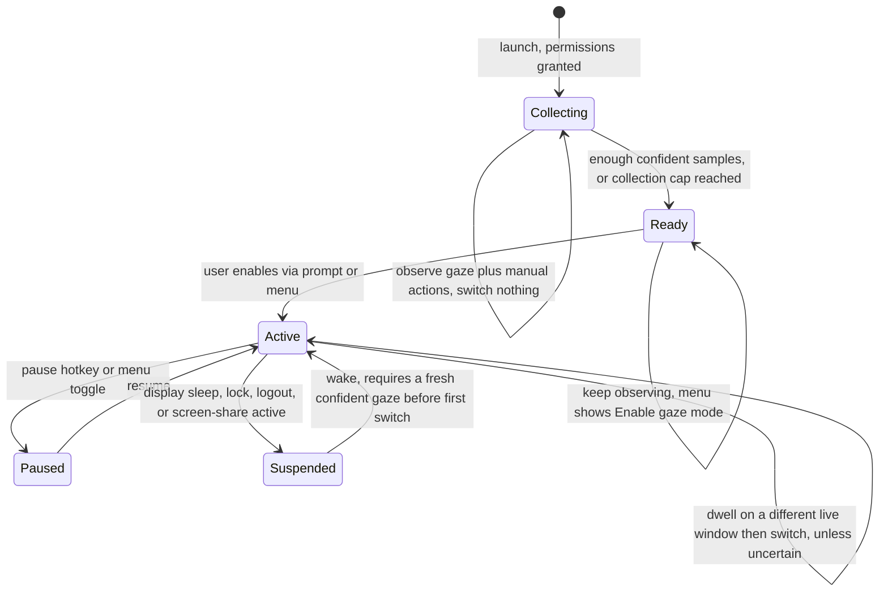
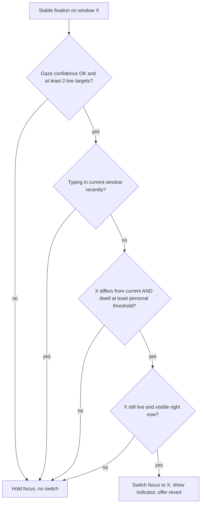
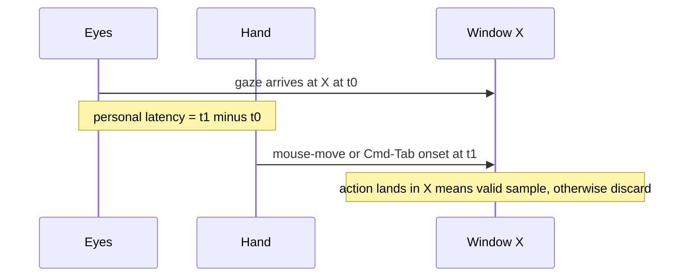

# Adaptive Gaze Focus Switcher (MVP)

## Summary

A macOS menu-bar utility that switches keyboard focus to whichever side-by-side terminal window you rest your eyes on — no key, no mouse. It commits on a short gaze dwell, holds focus whenever it's uncertain (typing, low confidence, ambiguous target), and learns your personal "look-then-act" timing from normal usage so switching converges toward feeling instantaneous and invisible.

---

## Problem Frame

On macOS nothing moves window focus by where you look. Switching among 2–3 side-by-side terminals means reaching for the mouse or cycling Cmd-Tab mid-flow — a small, constant tax on a developer who otherwise lives on the keyboard. Apple's Eye Tracking ships only on iOS/iPadOS and is closed to third parties; Vision Pro's look-to-focus + pinch validates the paradigm but exists nowhere on the Mac.

The opening is real because the job is *coarse and low-frequency*: a developer switches focus on the order of tens of times per hour, not thousands, and only needs to tell two or three wide windows apart. Coarse left/center/right gaze clears a plain webcam's ~50mm error for windows that wide. The hard part was never the sensing — it is making a hands-free switch that **never grabs focus at the wrong moment**. That single failure (focus jumping away while you read a log, so your next keystrokes land in the wrong window) is what would make a developer uninstall on day one, and it is what this MVP is designed around. The governing principle throughout is *when in doubt, do not switch*.

---

## Key Decisions

- **Pure dwell, no confirm key — a deliberate, defended bet.** Focus commits when your gaze settles on a window past a personal dwell threshold — no chord, click, or blink. This is the most "magic" reading of the original ask and the user's explicit choice. It is also the *riskier* option: the upstream ideation ranked look-then-press (gaze aims, keypress commits) as the safer default and kept zero-confirm dwell as a "brave mode." This doc takes the brave-mode bet on purpose, defended not by a confirmation gesture but by four things together: the typing-guard (R7), a threshold set above casual-glance dwell (R12), the universal fail-safe (R8), and a wrong-switch recovery affordance (R10). **Fallback:** if the zero-focus-theft success criterion fails in testing, a look-then-press key-commit mode is the in-scope retreat (it is the contingency, not merely deferred).

- **Eye gaze, not head pose.** Two terminals side by side on one monitor sit within a few degrees of each other and you barely turn your head between them — you flick your eyes. Head-pose tracking (easier, calibration-free) cannot disambiguate same-screen windows, so the MVP requires true gaze estimation.

- **Window-agnostic targeting; "terminals" is a validation focus, not a capability limit.** The tool maps gaze to whichever on-screen *window rectangle* contains it. Nothing in the targeting logic is terminal-specific, so v1 operates on any standard window and does not build terminal-detection coupling that a later generalization would have to tear out. Scoping the *validation* to side-by-side terminals keeps the test honest; it also means window *geometry* (not titles or app identity) is all that's read, which avoids needing the Screen Recording permission.

- **Personalized look-then-act latency is the seamless mechanism — bounded, not open-ended.** Eyes lead the hand: gaze lands on a target before the mouse or keyboard acts on it. The interval between gaze arriving at a window and the subsequent manual action is a zero-label measurement of *this user's* "I've decided" moment, and the dwell threshold is derived from it (R11) so the auto-switch fires when the user would naturally have acted. Two honest limits shape the design: the interval's *magnitude* is context-dependent (a pre-decided switch is fast and tight; a reactive glance-then-decide is slow and variable), so the threshold uses a robust statistic and is placed to separate commits from casual glances (R12), not a raw average; and the signal is richest during the mouse-driven collection phase and degrades once the user is on pure gaze, so the model **converges during collection and then stabilizes** rather than compounding forever (R17).

- **Graduated cold-start, bounded so it can never strand you.** On first run the tool only observes and switches nothing (R14). When it has learned your timing confidently it prompts once to enable gaze mode; if it can't reach confidence within a bounded period (or your latency distribution is too wide to yield a confident threshold), it offers to graduate with a conservative default instead of waiting forever, and you can enable gaze mode manually from the menu at any time (R15, R16). The observe period is mostly invisible because the signal comes from behavior you already produce.

- **On-device, and the model improves with use — framed as a quality benefit, not a moat.** All gaze inference and learning run locally; nothing leaves the Mac (R27). The model fitting you better over time is a UX quality benefit, *not* a lock-in/retention weapon — for a free local single-user tool that framing is hollow and would push toward user-hostile non-portability. The model is therefore exportable by design (R28). The durable advantage is the genuine market gap, not relearning cost.

- **Fail-safe is the spine.** Every uncertain condition resolves to "hold current focus, switch nothing" (R8). This single rule absorbs low gaze confidence, ambiguous targets, a target that vanishes mid-dwell, post-wake stale estimates, lost permissions, fullscreen/single-window Spaces, and a second display appearing — so each is a defined safe degradation rather than undefined behavior.

---

## Lifecycle

The tool moves through these states; switching is live only in Active, and any uncertainty drops it back to holding focus.

The commit decision inside Active is a chain of fail-safe gates; any "no" holds focus:

The learning signal, captured passively during the mouse-driven phase:

---

## Key Flows

- F1. Cold-start collection and bounded graduation
  - **Trigger:** First launch with permissions granted (or model reset).
  - **Steps:** Tool observes gaze + manual focus actions, captures look-then-act samples, switches nothing, shows collection progress. On reaching confidence it prompts once to enable gaze mode; if the collection cap is hit first, it offers to graduate with a conservative default.
  - **Outcome:** User enables → Active. User declines or isn't prompted yet → stays in Collecting/Ready with a persistent menu CTA to enable.
  - **Covered by:** R11, R12, R13, R14, R15, R16, R22

- F2. Active dwell switch (happy path, fail-safe gated)
  - **Trigger:** In Active, gaze settles on a window other than the current one.
  - **Steps:** Saccades filtered; proceed only if gaze confidence is adequate and ≥2 live targets exist, the user isn't actively typing, dwell exceeds the personal threshold, and the target is still live and visible at commit time. Then raise + set keyboard focus and show the tool's switch indicator.
  - **Outcome:** The gazed window becomes active; a noticeable signal and a revert affordance accompany the switch.
  - **Covered by:** R4, R5, R6, R8, R9, R10, R21

- F3. Typing-guard suppression
  - **Trigger:** Recent keystrokes in the current window.
  - **Steps:** While actively typing, switching is suppressed; it re-arms after a brief typing pause. The menu reflects armed vs. suppressed.
  - **Outcome:** Reading another window mid-task never steals focus.
  - **Covered by:** R7, R20

- F4. Passive learning sample capture
  - **Trigger:** A manual focus action (mouse move+click, Cmd-Tab/keybind) follows a gaze arrival.
  - **Steps:** If the manual action lands in the same window the gaze was on, record the gaze-onset → action-onset interval and the gaze→window mapping; discard otherwise. Continues at low volume after activation to re-mine fresh samples.
  - **Outcome:** The personal threshold and calibration converge during collection and stay refreshed afterward.
  - **Covered by:** R11, R12, R13, R17

- F5. Wrong-switch recovery
  - **Trigger:** An auto-switch the user did not want.
  - **Steps:** The switch produced a noticeable, time-bounded signal; the user invokes the revert action (within N seconds) to restore the prior focus. A reverted switch is fed back as a negative learning signal.
  - **Outcome:** Focus returns; the threshold lengthens over time.
  - **Covered by:** R10, R17, R21

- F6. Pause, suspend, and degrade
  - **Trigger:** User pauses; or the system sleeps/locks/logs out; or a screen-share/recording starts; or gaze tracking is lost; or permission is revoked.
  - **Steps:** Switching halts and camera capture stops (manual pause, sleep/lock, or screen-share); tracking-loss or lost permission drops to a clearly-indicated inactive state. On wake/resume a fresh confident gaze is required before the first switch.
  - **Outcome:** Focus stays put; no switch on a stale or low-confidence estimate; the menu always shows why.
  - **Covered by:** R8, R18, R19, R23, R24, R25, R26

---

## Requirements

**Sensing & targeting**

- R1. The tool estimates the user's on-screen gaze point from the Mac's webcam, accurately enough to disambiguate 2–3 side-by-side windows at a normal seated viewing distance.
- R2. Selectable targets are the actual on-screen window rectangles, mapped live; gaze resolves to whichever window's box contains it. Targeting reads window geometry only (not titles or app identity) and is window-agnostic — v1 validates against terminals but builds no terminal-specific filter.
- R3. The tool makes no switch — rather than guessing — when gaze falls in an ambiguous zone (near a shared border or where windows overlap), when more windows are present than gaze can reliably distinguish, or when windows are too small to separate.

**Selection & safety (never grab focus at the wrong moment)**

- R4. In the active state, focus commits on gaze dwell alone — no key, click, blink, or voice.
- R5. In-transit eye movements (saccades) are filtered; only a stabilized fixation can begin a dwell.
- R6. A switch fires only on a sustained, confident fixation on a window *different* from the current one; the current window stays focused with no gaze effort (sticky focus). A dwell on the already-focused window is a no-op — no focus call and no switch indicator re-trigger.
- R7. While the user is actively typing in the current window, gaze-switching is suppressed and re-arms only after a brief typing pause.
- R8. Fail-safe to sticky focus whenever targeting is uncertain: low gaze confidence, no face/eyes detected, fewer than two live targets on the current Space, a stale estimate immediately after wake, or a lost permission all resolve to "hold current focus, switch nothing," reflected in the menu-bar state.
- R9. Target re-validation at commit: the dwell target must be live and visible when focus is set; abort (no-op) if it closed, quit, minimized, or became occluded during the dwell. A window appearing under the gaze mid-dwell does not retroactively satisfy an in-progress dwell.
- R10. Recovery: every auto-switch produces a noticeable, time-bounded signal that a switch occurred, and a defined revert action restores the prior focus (e.g., the pause hotkey reverts the most recent switch within N seconds, or a dedicated undo).

**Learning & cold-start**

- R11. The tool measures the user's gaze-arrival → manual-action latency and derives the dwell threshold from a robust statistic of it, not a raw mean.
- R12. The threshold separates intentional commits from casual reading glances: the tool learns both the commit-latency and the casual-glance dwell ranges and places the threshold above the glance range, so a non-typing reading pause does not trigger a switch.
- R13. A learning sample counts only when the manual action lands in the same window the gaze was on; unrelated mouse motion is discarded.
- R14. On first run the tool enters a Collecting state that observes only and switches nothing.
- R15. Collection is bounded: on reaching confidence the tool prompts once to enable gaze mode; if confidence isn't reached within a bounded period, or the latency distribution is too wide/multimodal for a confident threshold, the tool offers to graduate with a conservative default rather than stranding the user. The user can also enable gaze mode manually from the menu at any time.
- R16. Ready state: the tool keeps observing, and the menu surfaces a clear, labeled "Enable gaze mode" call-to-action using the same wording as the prompt. Auto-switching activates only on acceptance; a user who declines the prompt is never stranded because the menu CTA persists.
- R17. Post-activation adaptation uses the coarser signals still available: a switch the user reverts within N seconds is a negative signal (lengthen the threshold), and the occasional manual switch is re-mined as a fresh latency sample. The model is understood to converge during collection and then stabilize, not to keep sharpening indefinitely.

**Control, state & feedback**

- R18. A global hotkey and a menu-bar toggle pause and resume gaze-switching at any time.
- R19. In the paused/off state, camera capture stops — not merely software-muted.
- R20. The menu bar shows the current state, distinguishing at least: collecting, ready, active-armed, active-suppressed (typing-guard), tracking-lost, and paused.
- R21. On a switch, the newly focused window is made unmistakable by a tool-provided supplemental indicator, not by native macOS focus chrome alone (which dark/transparent terminal themes often suppress).
- R22. During collection, the tool surfaces progress toward readiness so the user knows how close it is to graduating.
- R23. Before Accessibility and Camera permissions are granted, the tool shows a clear inactive state with guidance toward granting them; it never silently fails to switch.

**System events**

- R24. On display sleep, screen lock, or logout, camera capture stops and switching suspends; on wake, a fresh confident gaze is required before the first switch, so no focus grab fires on a stale estimate.
- R25. Runtime environment changes degrade safely: a second display connected → tracking confines to the primary display and ignores other-display windows; fullscreen or a Space with fewer than two targets → switching is inert; a permission revoked at runtime → a clearly-indicated disabled state.
- R26. When a screen-recording or screen-sharing session is active, the tool auto-pauses switching (or surfaces a persistent warning) so a focus change can't reveal another window's contents to viewers.

**Privacy & trust**

- R27. All gaze inference and learned data stay on-device; no image or gaze data leaves the Mac, and the macOS camera-in-use indicator is respected.
- R28. The stored model and samples are treated as sensitive behavioral data: kept in a sandboxed container, excluded from cloud/Time Machine backup, and encrypted at rest. Raw samples are deleted after the model processes them (or within a bounded retention window); only derived threshold/calibration parameters persist long-term. The model is user-exportable.
- R29. The Accessibility grant is a high-value trust boundary: the tool requests the minimum API surface it needs, runs any third-party gaze-estimation component in a sandboxed subprocess without Accessibility entitlements, and changes window focus only — it never injects synthetic keyboard or mouse events.

---

## Acceptance Examples

- AE1. Covers F2 / R4, R6. **Given** gaze mode is active and focus is on the left terminal, **when** the user holds a stable fixation on the right terminal past the personal dwell threshold, **then** focus moves to the right terminal.
- AE2. Covers F3 / R7. **Given** the user is typing in the left terminal, **when** they glance at the right terminal to read a log for a second, **then** focus stays on the left terminal and keystrokes continue to land there.
- AE3. Covers F2 / R5, R12. **Given** gaze mode is active, **when** the user's eyes sweep across or briefly rest on the right terminal during a reading pause without exceeding the commit threshold, **then** no switch occurs.
- AE4. Covers F2 / R9. **Given** the user has dwelled on the right terminal, **when** that window closes or is minimized just before commit, **then** the switch is aborted (no-op) and focus stays on the left terminal.
- AE5. Covers F2 / R6. **Given** focus is on the left terminal, **when** the user's gaze rests on that same left terminal, **then** nothing happens — no re-focus and no switch indicator.
- AE6. Covers F2 / R8. **Given** gaze mode is active, **when** the webcam is occluded or the user looks away from the screen, **then** the tool holds current focus, makes no switch, and shows a tracking-lost state.
- AE7. Covers F4 / R13. **Given** any state, **when** the user's gaze rests on the right terminal and they then click into the *left* terminal, **then** no learning sample is recorded.
- AE8. Covers F1 / R14, R15. **Given** first run, **when** the user works normally, **then** no focus switch happens until either the model reaches confidence and the user accepts the prompt, or the user enables gaze mode from the menu.
- AE9. Covers F5 / R10. **Given** an auto-switch the user did not want, **when** they invoke the revert action within the recovery window, **then** the prior focus is restored and the event is fed back as a negative learning signal.
- AE10. Covers F6 / R26. **Given** gaze mode is active, **when** a screen-recording or screen-sharing session starts, **then** switching auto-pauses (or a persistent warning appears).

---

## Success Criteria

- Zero focus theft while typing: in testing, no auto-switch fires during an active typing burst in the current window.
- No surprise switches during reading pauses: the threshold sits above the user's casual-glance dwell, and ambiguous or uncertain gaze produces no switch rather than a wrong one.
- Reliable disambiguation of 2–3 side-by-side windows on confident fixations.
- "Seamless" feel: after collection, auto-switches fire at the user's natural look-then-act moment — subjectively neither premature nor laggy.
- Bounded onboarding: the user reaches a usable Active state within one realistic session — via confident graduation, the collection-cap default, or manual enable — never stranded in Collecting.
- Recoverable: a wrong switch is noticeable and reversible with one action, and the user can always tell which window is focused via the tool's own indicator.
- Trust controls: pause/resume is instant and obvious, and the tool degrades to a clearly-indicated safe state on tracking loss, sleep, screen-share, or revoked permission.

---

## Scope Boundaries

**Deferred for later**

- Multi-monitor and laptop-plus-external-display setups (v1 confines to the primary display).
- tmux / iTerm pane-level selection (sub-window targets too narrow for webcam accuracy).
- Generalizing beyond the terminal validation focus to arbitrary apps or workspace/project regions (the mechanism already allows it; v1 just doesn't validate it).
- A visible dwell progress ring with look-away-to-abort (set aside in favor of the typing-guard + threshold-above-glance + recovery affordance).
- Read-vs-target scanpath classification beyond the typing-guard and glance/commit threshold.
- iPhone Continuity Camera (TrueDepth) as a higher-accuracy sensor.

**In-scope fallback (not deferred)**

- A look-then-press key-commit mode is the retreat if pure dwell fails the zero-focus-theft criterion in testing. It is held as a contingency, not built up front, but it is explicitly inside the MVP's risk envelope.

**Outside this product's identity**

These are separate products from the ideation set, not v1 features of a focus switcher: a general gaze "attention event bus," gaze-as-destination ("send this to the terminal I'm looking at"), gaze as context for AI coding agents, attention-gated notification routing, and attention analytics/heatmaps.

---

## Dependencies / Assumptions

- macOS Accessibility permission (to set window focus) and Camera permission (for gaze estimation) are required; the tool is inactive until both are granted. Screen Recording permission is *not* required because targeting reads window geometry only, not titles/app identity (R2).
- The Accessibility grant is broad — it can read and modify focus state of any window — so it is treated as a high-value trust boundary (R29). A compromise in a third-party gaze library must not be able to pivot that grant into keylogging or event injection.
- Webcam gaze estimation, once calibrated, resolves coarse left/center/right reliably at a normal seated distance. (Assumption — `ce-plan` validates the estimation approach and achievable accuracy.)
- Eyes lead the hand: gaze precedes manual action, so the gaze-onset → action-onset interval is a valid per-user signal. Its *direction* is well-established; its *magnitude* is context-dependent, so the threshold is a robust statistic placed above the casual-glance range, not a raw mean (R11, R12).
- The user produces enough manual focus actions during cold-start to train the model; the collection cap + default-graduation (R15) bound the risk that they don't.
- v1 targets a single Apple Silicon Mac, single user, single monitor.

---

## Outstanding Questions

**Resolve before planning**

- None blocking. The pure-dwell-vs-key-commit bet is recorded as a deliberate decision with a fallback (Key Decisions); the user affirmed pure dwell.

**Deferred to planning**

- Gaze-estimation approach and library, and the calibration UX (explicit quick calibration vs. purely passive self-calibration from manual switches).
- The collection-cap value and the "enough confident samples" criterion that triggers the graduation prompt — bounded by an estimate of how many qualifying samples a typical developer session produces.
- How to separate the casual-glance dwell distribution from the commit-latency distribution, and the default dwell used before personalization.
- The recovery window length N (seconds) and whether revert is the pause hotkey or a dedicated undo.
- The exact re-prompt policy after a decline (prompt cadence vs. menu-CTA-only).
- A precise definition of a "clean sample" (spatial tolerance and temporal window) and of "actively typing" (keystroke-recency window).
- Focus semantics for *overlapping* windows specifically — raise-and-focus is the default (F2, R21); the open part is only how to handle a target fully behind another window.
- Encryption-at-rest mechanism and backup-exclusion approach for the stored model/samples.
- Screen-recording/sharing detection mechanism and whether the response is auto-pause or persistent warning.

---

## Sources / Research

- Ideation: `2026-06-13-gaze-terminal-selector-ideation.html` — this MVP is idea #1 ("先看后按 · 粗分区切换器"), pivoted from key-commit to pure dwell (with key-commit retained as the in-scope fallback), and with idea #3 (self-calibration from manual switches) folded in as the core learning signal.
- Prior art: no shipping macOS gaze→window-focus tool exists; Vision Pro look-to-focus + pinch validates the paradigm; Tobii's gaze-highlighted Alt+Tab is Windows-only and hardware-bound. Webcam gaze ≈ 3–4° / ~50mm error (calibrated); dedicated trackers ≈ 0.5°.
- macOS feasibility anchors: `CGWindowListCopyWindowInfo` for window geometry (no permission); the Accessibility API (`AXUIElement`) to set focus (permission required); `AutoRaise` (focus-follows-mouse daemon) as the closest architectural analog.
- HCI grounding: gaze precedes manual pointing (eye-leads-hand), with the interval's magnitude context-dependent; Midas-touch defenses ranked look-then-press > voice > long dwell > blink, with fixation filtering (~150ms) separating saccades from fixations.
