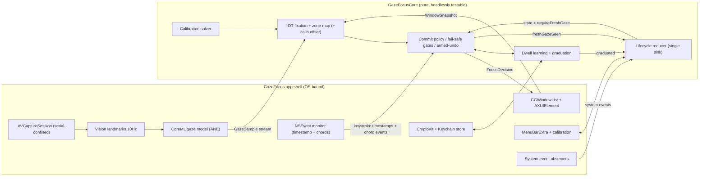
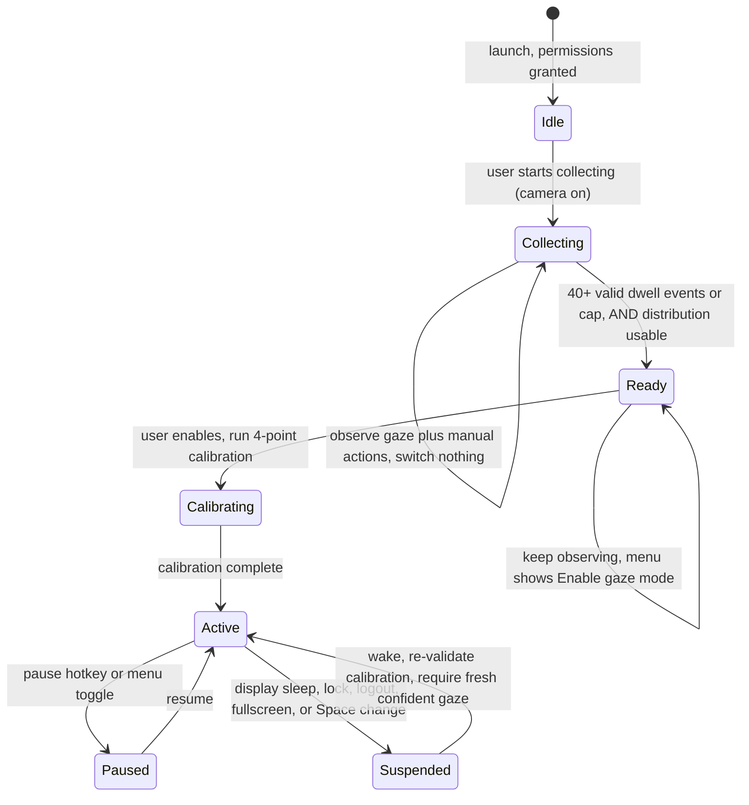
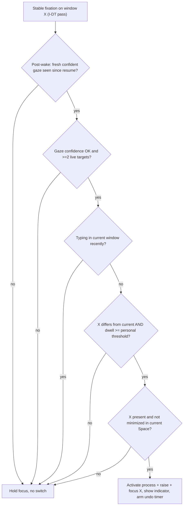

# feat: Adaptive Gaze Focus Switcher (MVP)

## Summary

Build a native macOS menu-bar utility that switches keyboard focus to whichever side-by-side terminal window the user looks at, committing on a short personalized gaze dwell with no key or mouse. The architecture is a headlessly-testable `GazeFocusCore` SwiftPM library (all perception, decision, learning, and lifecycle logic) consumed by a thin `GazeFocus` agent app (camera capture, Vision + CoreML gaze inference, Accessibility window control, menu-bar UI). It is built fail-safe-first: every uncertain condition holds focus rather than switching. Two on-device measurements gate the whole effort — gaze-accuracy and the silent-reading-pause false-switch rate (Risks).

---

## Problem Frame

No macOS tool moves window focus by gaze; switching among 2–3 side-by-side terminals forces a reach for the mouse or a Cmd-Tab cycle mid-flow (see origin: `docs/brainstorms/2026-06-13-gaze-terminal-focus-requirements.md`). The job is coarse and low-frequency, so a plain webcam suffices — the engineering risk is entirely in *never grabbing focus at the wrong moment*, since one wrong switch while reading a log sends keystrokes into the wrong window. The plan treats the fail-safe gate chain, the typing-guard, the dwell-threshold floor, and the wrong-switch recovery as the load-bearing work. Two bets are validated on-device before features build on them: (1) can a webcam separate left/center/right at all, and (2) can pure dwell avoid false switches during a *deliberate reading pause* — the case where the user stops typing to study an adjacent window, which the typing-guard does not cover.

---

## Requirements

This plan implements all 29 requirements (R1–R29), six flows (F1–F6), and ten acceptance examples (AE1–AE10) from the origin; full prose lives there. They group into six concerns:

- **Sensing & targeting** (R1–R3): coarse webcam gaze, window-rectangle targets read from geometry + owner PID/name, no-switch on ambiguous/too-many targets.
- **Selection & safety** (R4–R10): dwell-only commit, saccade filtering, sticky focus, typing-guard, the universal fail-safe, commit-time target re-validation, wrong-switch recovery.
- **Learning & cold-start** (R11–R17): personalized dwell threshold, glance-vs-commit separation, bounded collection with graduation, post-activation adaptation.
- **Control, state & feedback** (R18–R23): pause hotkey + menu toggle, true camera-off, menu state legibility, tool-provided switch indicator, progress, permission-denied state.
- **System events** (R24–R26): sleep/lock/wake, multi-display/fullscreen degradation, screen-share handling.
- **Privacy & trust** (R27–R29): on-device only, sensitive-data protection, Accessibility trust-boundary minimization.

A traceability table (R-ID → unit) appears under Implementation Units.

**Confirmed plan-level decisions from scoping (this run):**

1. The learning signal is **retargeted** from "eye→manual-action latency" to the user's **minimum intentional dwell duration** (R11/R12 reinterpreted — KTD5). The eye-leads-hand signal moves to Deferred Follow-Up.
2. A one-time **4-point calibration** is added at graduation (KTD3).
3. Screen-share/recording auto-pause (R26) is **deferred**; a cheap permission-free *warning* replaces it in v1 (KTD13).
4. Distribution is **non-sandboxed Developer-ID + notarized, not Mac App Store** (KTD8).

---

## Key Technical Decisions

- KTD1. **Two-target layout: testable core + thin agent shell.** `GazeFocusCore` is a platform-independent SwiftPM library (no AVFoundation/AppKit imports) holding fixation detection, the commit policy, dwell learning, the calibration solver, and the lifecycle reducer as pure logic over injected streams; the `GazeFocus` Xcode app target owns all OS calls behind protocol seams. Mirrors the sibling `personal_os` `PersonalOSCore` convention.

- KTD2. **Gaze = Apple Vision landmarks + a CoreML regression model, on the Neural Engine.** `VNDetectFaceLandmarksRequest` (rev 3: pupils + head pose) supplies eye crops and pose; a converted L2CS-Net model (MIT, ~3.9° MAE on MPIIFaceGaze) outputs yaw/pitch, mapped to left/center/right zones. ARKit `lookAtPoint` (iOS/TrueDepth-only) and MediaPipe (no native macOS Swift path) are rejected. Whether a converted model separates zones on a real webcam is the top unvalidated bet, gated by a kill-criterion (Risks).

- KTD3. **One-time 4-point calibration at graduation.** Calibration anchors the per-user offset that uncalibrated appearance models get wrong by 5–15°. The solver and per-point fixation acceptance are pure core logic; only target rendering is in the shell. Calibration is **session-volatile on a laptop** (offset depends on seating distance and lid angle), so it is re-validated on wake (KTD12 / U12) rather than treated as permanent.

- KTD4. **I-DT fixation detection (dispersion 1.0°, 100 ms window), not I-VT.** Higher F1 (0.96 vs 0.94) and more robust on noisy webcam signal. A stable fixation must be confirmed before the dwell clock starts — this dispersion gate, not duration alone, separates a casual glance from a commit (fixation durations are unimodal).

- KTD5. **Learning target = minimum intentional dwell, learned as a percentile, gated on distribution quality, layered on a default.** The personalized threshold is the **80th percentile** of valid dwell events from a **bounded ~100-sample recent buffer**, not a mean (right-skewed) and not eye→action latency. A **valid dwell event** is a stable I-DT fixation on a window held past the active threshold with no concurrent typing — in Collecting it is logged without switching; in Active it must not be immediately reverted (this filter carries the intent of origin R13/F4/AE7 without collecting latency). Cold-start default **600 ms**, user-adjustable via a slider (KTD14); bounds **[300, 1000] ms**; graduation requires **≥40 valid events or the collection cap** AND a **sufficiently narrow/unimodal** distribution — if the distribution is too wide or multimodal for a confident threshold (origin R15's escape hatch), the tool pins to the default+slider and says so rather than fitting a bad threshold. Post-activation, a switch reverted within the recovery window applies a bounded lengthening nudge (R17). The fit is enabled only after the fail-safe spine is validated on-device (Phasing). A train/serve caveat is open: Collecting dwells are observed without a switch while Active dwells drive one — whether the learned value transfers is part of the on-device validation (Open Questions).

- KTD6. **Window control = `CGWindowListCopyWindowInfo` + Accessibility + process activation.** Geometry, owner PID, and owner name come from `CGWindowListCopyWindowInfo(.optionOnScreenOnly)` with **no Screen Recording permission** (only window *titles* would need it, never read). Focus = `NSRunningApplication(pid).activate()` then `AXUIElementSetAttributeValue` (`kAXMainWindowAttribute`/`kAXFocusedWindowAttribute`) + `AXUIElementPerformAction(kAXRaiseAction)`. Raising alone does not move keyboard focus — activation is required.

- KTD7. **Two TCC permissions: Accessibility + Camera; gaze pipeline in-process for v1.** The typing-guard observes keystroke *timing only* via `NSEvent.addGlobalMonitorForEvents` (`.keyDown`), riding the Accessibility grant — no extra permission, no `event.characters`, no modifier flags (a guarded invariant: the timestamp is extracted at source so content never enters a variable). The same monitor detects the pause/undo chords (two hardcoded Cmd/Ctrl-modified chords), so no third-party hotkey library is needed. The origin's R29 entitlement-free XPC subprocess for the gaze component is **deferred**: v1 runs Vision + CoreML in-process. The residual blast-radius risk is accepted for v1 (bundled offline MIT model, not a live runtime; notarized binary); XPC isolation is a named Deferred hardening item with a re-evaluation gate (Scope Boundaries).

- KTD8. **Non-sandboxed, Developer-ID-signed + notarized; not Mac App Store.** Accessibility cannot coexist with the App Sandbox; the MAS mandates sandboxing for new apps. Hard constraint.

- KTD9. **Real-time capture path: simplest serial-confined structure first; escalate only if the spike requires it.** The pipeline is a linear single-consumer chain. The U7 spike evaluates a plain serial-queue-confined object first; the `actor`-with-custom-executor pattern is adopted only if the simpler form fails complete-concurrency checking. The `nonisolated` delegate extracts the Sendable `CVPixelBuffer` from the non-Sendable `CMSampleBuffer` before crossing any boundary; `@preconcurrency` suppression is the last resort. Top technical risk.

- KTD10. **Encryption at rest = FileVault + CryptoKit AES.GCM + Keychain-held key; passphrase-sealed export.** `NSFileProtectionComplete` is non-functional on macOS and rejected. Fitted params (a few floats) + the small recent window are sealed with `AES.GCM` (AAD = bundle-id + schema version) under a 256-bit Keychain key, ACL-bound to the signed app identity and `kSecAttrAccessibleWhenUnlockedThisDeviceOnly`; the file lives in per-user `~/Library/Application Support/<bundle-id>/` with `isExcludedFromBackup`. No key rotation (erase-and-relearn). **Export** is passphrase-sealed (user passphrase, CryptoKit AES.GCM with a KDF), contains derived params + calibration only (never raw samples), and warns the user the file is personal behavioral data.

- KTD11. **True camera-off via `stopRunning()`.** The LED is hardware-wired to sensor power; no software mute. Pause and sleep/lock/suspend call `stopRunning()`; toggles are debounced to avoid the ~10 s hardware freeze.

- KTD12. **Fail-safe spine: uncertainty holds focus.** Low gaze confidence, fewer than two live targets, a fullscreen target or Space change, a post-wake stale estimate, and lost Accessibility all resolve to "hold, switch nothing." Space identity needs private APIs, so the plan pauses on `activeSpaceDidChangeNotification` (native fullscreen is its own Space, covered by the same signal). Commit-time "visible" (U4 gate E / R9) is a *decidable* predicate — present and not minimized in the current Space; true occlusion behind another window is approximated via `kCGWindowLayer`/bounds-intersection with limits named, and full occlusion detection is Deferred. **Calibration drift produces confident-but-wrong estimates the spine does not catch**, so the offset is re-validated on wake (U12) — a recalibrate-or-invalidate trigger, not a permanent value.

- KTD13. **Screen-share auto-pause deferred; a warning ships instead — but the residual risk is third-party confidentiality, not user annoyance.** A gaze switch during a screen-share can reveal another terminal's contents (secrets, other customers' data) to everyone on the call, triggered by an involuntary glance. Reliable detection needs the Screen Recording permission + a recurring macOS prompt; `CGDisplayIsCaptured` is deprecated and misses ScreenCaptureKit. v1 ships a permission-free onboarding/menu **warning** recommending manual pause; AE10 is explicitly unmet in v1. A cheap conferencing-process/window heuristic (Zoom/Meet/Teams presence) is noted as a possible partial follow-up but not built in v1.

- KTD14. **Camera capture is opt-in at the front of the lifecycle (the `Idle` state), and Collecting visibly reads as "camera on."** Granting Camera permission does not start capture; from `Idle` the user takes an explicit "Start collecting" action before the `AVCaptureSession` runs, and the menu makes camera-active unmistakable throughout Collecting. A dwell-threshold **slider** (default 600 ms) gives a manual override independent of the learning fit, and a way to prove the core bet before learning is enabled.

---

## High-Level Technical Design

**Component and data flow** — the OS-touching shell feeds Sendable events into the pure core; a single lifecycle reducer is the sole sink for both system events and learning graduation:



**Lifecycle** — switching is live only in Active; the reducer (U14) owns this transition function:



**Commit decision** — the fail-safe gate chain inside Active; any "no" holds focus:



---

## Output Structure

```text
eyetracker/
  Package.swift                      # GazeFocusCore library (swift-tools-version 6.0, .macOS(.v15))
  Sources/GazeFocusCore/
    Model/                           # GazeSample, WindowSnapshot, Zone, LifecycleState, events (Sendable)
    Perception/                      # I-DT fixation, gaze->zone/window mapping, calibration offset + solver
    Policy/                          # commit gate chain, typing-guard, fail-safe, armed-undo timer
    Learning/                        # dwell-threshold percentile, distribution gate, recent buffer, graduation
    Lifecycle/                       # reducer: single sink for system + learning events
    Ports/                           # WindowControl, GazeSource, KeystrokeActivity, Clock, ModelStore protocols
  Tests/GazeFocusCoreTests/          # synthetic-stream unit tests for all of the above
  App/                               # Xcode app target "GazeFocus" (LSUIElement agent) referencing the local package
    GazeFocusApp.swift               # @main, MenuBarExtra, NSApplicationDelegateAdaptor
    Capture/  WindowControl/  Input/  Calibration/  SystemEvents/  LoginItem/  Storage/  UI/
    Resources/GazeModel.mlpackage    # converted L2CS-Net (build artifact of Scripts/)
    Info.plist                       # LSUIElement, NSCameraUsageDescription, NSCameraUseContinuityCameraDeviceType
  GazeFocus.xcworkspace              # binds the Xcode app target to the local SwiftPM package
  Scripts/convert_gaze_model.py      # offline coremltools L2CS-Net -> .mlpackage
```

The per-unit `Files` lists are authoritative; the implementer may adjust this layout.

---

## Implementation Units

Phased: **Phase 1 (U1–U5, U14)** builds the decision/learning/lifecycle core with zero OS dependencies (within the phase, U2 precedes U14 precedes U4; U5 is independent of U14); **Phase 2 (U6–U9)** adds sensing and OS control; **Phase 3 (U10–U13, U15)** assembles the shell, calibration, lifecycle wiring, and persistence. U10 and U12 wire into the U14 reducer built in Phase 1. **Sequencing gate:** validate the fail-safe spine on-device (U3, U4, U7, U8) with the fixed 600 ms default, and pass both U7 spikes (Risks), *before* enabling the U5 learning fit or building U11.

### U1. Project scaffold: two-target layout

**Goal:** Stand up the `GazeFocusCore` SwiftPM library and the `GazeFocus` Xcode app target — bound together — with a green `swift test` and a launchable empty menu-bar app.
**Requirements:** Foundation for all.
**Dependencies:** none.
**Files:** `Package.swift`, `Sources/GazeFocusCore/GazeFocusCore.swift`, `Tests/GazeFocusCoreTests/SmokeTests.swift`, `App/GazeFocusApp.swift`, `App/Info.plist`, `GazeFocus.xcworkspace`.
**Approach:** Library targets `.macOS(.v15)`, swift-tools 6.0, complete concurrency checking on. The `GazeFocus` Xcode app target references `GazeFocusCore` as a **local SwiftPM package** inside an `.xcworkspace` (the binding mechanism — the sibling `personal_os` commits loose app `.swift` files with no `.xcodeproj`, so there is no in-repo template for this and it must be decided here). App is a `MenuBarExtra` agent with `LSUIElement` = YES + `NSApp.setActivationPolicy(.accessory)`; Info.plist carries `NSCameraUsageDescription` and `NSCameraUseContinuityCameraDeviceType`. No camera/AX code yet.
**Patterns to follow:** `personal_os/Package.swift` core+app split, with the workspace binding added.
**Test scenarios:** `Test expectation: none -- scaffold`; CI runs `swift build` + `swift test` green; a separate check confirms the app target links `GazeFocusCore` and launches.
**Verification:** `swift test` green; the app launches as a menu-bar item with no Dock icon and imports the core.

### U2. Core domain model + protocol seams

**Goal:** Define the Sendable value types, event types, and OS-abstraction protocols the core depends on.
**Requirements:** R2, R8 (seams).
**Dependencies:** U1.
**Files:** `Sources/GazeFocusCore/Model/*.swift`, `Sources/GazeFocusCore/Ports/*.swift`, `Tests/GazeFocusCoreTests/ModelTests.swift`.
**Approach:** `GazeSample` (timestamp, normalized point or yaw/pitch, confidence — Sendable), `WindowSnapshot` (id, ownerPID, ownerName, bounds), `Zone`/`Target`, `LifecycleState` (idle, collecting, ready, calibrating, active, paused, suspended), `SystemEvent` and `LearningEvent` enums (the latter includes `graduated`, `enabled`, `calibrated`, `freshGazeSeen`), `FocusDecision`. Protocols: `WindowControl`, `GazeSource`, `KeystrokeActivity` (forwards keystroke events stamped in the core `Clock`'s time base — never raw `NSEvent.timestamp`), `Clock`, `ModelStore`.
**Patterns to follow:** protocol-port + injected `Clock`.
**Test scenarios:** value types `Sendable`/`Equatable`; event enums exhaustive; mock conformances compile.
**Verification:** core compiles with no AppKit/AVFoundation import.

### U3. I-DT fixation detection + target resolution

**Goal:** Turn a noisy gaze stream into a stable fixation on a specific window, or no target.
**Requirements:** R1 (mapping), R2, R3, R5.
**Dependencies:** U2.
**Files:** `Sources/GazeFocusCore/Perception/FixationDetector.swift`, `Sources/GazeFocusCore/Perception/ZoneMapper.swift`, `Tests/GazeFocusCoreTests/FixationTests.swift`, `Tests/GazeFocusCoreTests/ZoneMapTests.swift`.
**Approach:** Sliding-window I-DT (dispersion 1.0°, min 100 ms) rejects saccades; `ZoneMapper` applies the core-owned calibration offset (U11) then maps to the containing `WindowSnapshot` (dead-band near shared borders); returns no-target when ambiguous, when more windows than the confidence radius can separate, or when windows are too small. Confidence radius and offset are shared core state.
**Patterns to follow:** pure function over injected sample buffer.
**Test scenarios:**
- Happy: stable cluster inside A → resolves to A.
- Edge (saccade): fast sweep → no fixation. *Covers AE3 partial.*
- Edge (border dead-band): A/B seam → no target.
- Edge (too many / too small): 5 narrow windows → no target. *Covers R3.*
- Edge (low confidence): sub-threshold → no fixation.
- Calibration applied: same raw gaze maps to different windows before/after a known offset.
**Verification:** all synthetic cases pass; thresholds configurable.

### U4. Commit policy + fail-safe gate chain + armed-undo

**Goal:** Turn a fixation into a switch — or hold — and own the recovery-window timer and post-wake gate.
**Requirements:** R4, R6, R7, R8, R9, R10.
**Dependencies:** U2, U3, U14.
**Files:** `Sources/GazeFocusCore/Policy/CommitPolicy.swift`, `Sources/GazeFocusCore/Policy/TypingGuard.swift`, `Sources/GazeFocusCore/Policy/ArmedUndo.swift`, `Tests/GazeFocusCoreTests/CommitPolicyTests.swift`, `Tests/GazeFocusCoreTests/ArmedUndoTests.swift`.
**Approach:** The gate chain: post-wake `requireFreshGaze` (read from U14 state; cleared by emitting a `freshGazeSeen` event to the reducer on the first confident fixation — an event, not a direct shared-state write) → confidence OK and ≥2 live targets → typing-guard (injected last-keystroke timestamp in the `Clock` time base vs recency window) → different window held past the dwell threshold → target present and not minimized at commit. Sticky focus otherwise; already-focused dwell is a no-op. On a switch, arm a `Clock`-driven N-second undo window during which the recovery action restores prior focus (R10).
**Patterns to follow:** gate order is load-bearing; all timing via injected `Clock`.
**Test scenarios:**
- Happy: fresh gaze seen, confident fixation on B, not typing, dwell ≥ threshold, B live → `switch(to: B)`. *Covers AE1.*
- Typing-guard: recent keystroke in A → `hold`. *Covers AE2.*
- Glance under threshold → `hold`. *Covers AE3.*
- Already-focused → `hold`, no re-emit. *Covers AE5.*
- Target vanished/minimized → `hold`. *Covers AE4.*
- Post-wake: first dwell after resume does not switch until a fresh confident fixation emits `freshGazeSeen`.
- Fail-safe: <2 targets or low confidence → `hold`. *Covers AE6 logic-side.*
- Armed-undo: switch then recovery within N seconds restores prior focus; after N seconds, no-op. *Covers AE9 logic-side.*
- Integration (core): a real `LifecycleReducer` + `CommitPolicy` — wake sets `requireFreshGaze`, policy holds, first confident fixation clears it via the reducer, next dwell switches.
**Verification:** every gate tested both arms; the dual-writer `requireFreshGaze` seam has an integration test; the undo window expires on the injected clock.

### U5. Dwell-threshold learning + graduation

**Goal:** Learn the personal dwell threshold from valid dwells, gate graduation on count *and* distribution quality, and detect convergence failure.
**Requirements:** R11, R12, R13 (reinterpreted), R14, R15, R16 (logic), R17.
**Dependencies:** U4.
**Files:** `Sources/GazeFocusCore/Learning/DwellModel.swift`, `Sources/GazeFocusCore/Learning/Graduation.swift`, `Sources/GazeFocusCore/Learning/RecentBuffer.swift`, `Tests/GazeFocusCoreTests/DwellModelTests.swift`.
**Approach:** A bounded ~100-sample recent buffer of valid dwell events (Collecting: a stable I-DT fixation held past the default with no concurrent typing, logged without a switch; Active: a confirmed switch not immediately reverted). Threshold = 80th percentile, bounded [300, 1000] ms, default 600 ms and slider-adjustable. Graduation requires ≥40 valid events or the cap **and** a distribution narrow/unimodal enough for a confident threshold; if it is too wide/multimodal (origin R15's escape hatch), pin to the default+slider and surface "couldn't personalize — using default." Post-activation, a reverted switch applies a bounded lengthening nudge (R17). A convergence-failure signal — a sustained high post-graduation revert rate — flags the learner as net-negative and falls back to the default. Only fitted params + the recent window persist (U13).
**Patterns to follow:** percentile over the buffer; all timing via `Clock`.
**Test scenarios:**
- Happy: 50 durations with known 80th percentile → threshold matches, in bounds.
- Bounds: percentile 1500 ms → 1000 ms; 150 ms → 300 ms.
- Graduation gate: 39 valid → not graduated; 40 + usable distribution → `graduated`. *Covers AE8 logic-side.*
- Distribution gate: 40+ events but a wide/bimodal set → pins to default, does not fit.
- Collection cap: cap with <40 → graduates with 600 ms default.
- Skew: right-skewed set → percentile (not mean) chosen.
- Revert nudge + convergence: a reverted switch lengthens; a sustained high revert rate trips the net-negative fallback.
- R13 intent: an immediately-reversed dwell is excluded.
**Verification:** percentile, both graduation gates, cap, revert-nudge, convergence-failure, and the valid-event filter covered; no eye→action-latency code.

### U6. Offline gaze-model conversion

**Goal:** Produce the embedded CoreML gaze model from open MIT weights, with verified provenance.
**Requirements:** R1 (model).
**Dependencies:** U1.
**Files:** `Scripts/convert_gaze_model.py`, `App/Resources/GazeModel.mlpackage` (generated), `Scripts/README.md`.
**Approach:** `coremltools` 7+ converts L2CS-Net (ResNet-50 or MobileOne-S0) via `torch.jit.trace` to a `.mlpackage` outputting yaw/pitch; bundled as a resource. `Scripts/README.md` records source weights, commit hash, MIT license, preprocessing — a security-adjacent provenance artifact tied to the build-time hash check.
**Patterns to follow:** pin model + commit hash; reproducible offline.
**Test scenarios:** `Test expectation: none -- offline tooling`; verification manual + build-time hash check.
**Verification:** `.mlpackage` loads and returns finite yaw/pitch on a sample image; build fails on hash mismatch.

### U7. Camera capture + Vision/CoreML gaze pipeline

**Goal:** Produce a live `GazeSample` stream from the webcam and feed it to the core; turn the camera fully off on demand.
**Requirements:** R1, R19, R27.
**Dependencies:** U2, U6.
**Files:** `App/Capture/CaptureController.swift`, `App/Capture/FrameDelegate.swift`, `App/Capture/GazePipeline.swift`, `App/Capture/CameraPermission.swift`.
**Approach:** A serial-queue-confined controller owns the `AVCaptureSession`; a `nonisolated` delegate extracts `CVPixelBuffer` from `CMSampleBuffer` and hands only Sendable data inward. Vision landmarks at ~10 Hz; CoreML on the ANE; outputs become `GazeSample`s on an `AsyncStream`. `VNDetectFaceLandmarksRequest` returns an array — select the largest/most-central face; treat **>1 confident face** (a person behind the user, a face on a video call, a poster) as low-confidence/hold, so a confident-but-wrong sample never defeats the fail-safe spine. `stopRunning()` powers the camera/LED fully off; capture starts only on the explicit "Start collecting" action (KTD14); never persists raw frames.
**Execution note:** Run three spikes before building features. (1) Concurrency: the simplest serial-confined structure under complete checking before any custom-executor actor (KTD9). (2) **Gaze-accuracy kill-criterion gate** — see Risks; a hard pass/fail bar, not a soft check. (3) **Silent-reading-pause false-switch gate** — see Risks; measure whether pure dwell avoids switching during a deliberate reading pause, the case the typing-guard cannot cover.
**Patterns to follow:** never cross isolation with `CMSampleBuffer`; `alwaysDiscardsLateVideoFrames = true`.
**Test scenarios:**
- Concurrency: capture path compiles clean under Swift 6.2 (the spike).
- Camera-off: after `stopRunning()`, `session.isRunning == false`.
- Throttle: a unit-testable frame-counter helper decimates to ~10 Hz.
- Multi-face: >1 confident face → low confidence (no confident wrong sample emitted).
- Integration (device): plausible yaw/pitch with a face; confidence drops when the face leaves frame. *Covers AE6 sensing-side.*
- Accuracy + reading-pause (device gates): see Risks.
**Verification:** all three spikes pass their bars; multi-face yields hold; camera LED extinguishes on pause; capture never starts before the explicit action.

### U8. Window control: enumerate, focus, permission health

**Goal:** Enumerate window rectangles and switch focus via Accessibility, with runtime permission monitoring.
**Requirements:** R2, R8, R23, R29.
**Dependencies:** U2.
**Files:** `App/WindowControl/CGWindowEnumerator.swift`, `App/WindowControl/AXWindowControl.swift`, `App/WindowControl/AccessibilityPermission.swift`.
**Approach:** `CGWindowListCopyWindowInfo(.optionOnScreenOnly)` → bounds + ownerPID + ownerName (no Screen Recording; titles never read). Focus = `NSRunningApplication(pid).activate()` then `AXUIElementSetAttributeValue` `kAXMainWindowAttribute`/`kAXFocusedWindowAttribute` + `AXUIElementPerformAction(kAXRaiseAction)`. `AXIsProcessTrustedWithOptions(prompt:)` onboarding; a health monitor polls `AXIsProcessTrusted()` and treats AX errors (`apiDisabled`/`cannotComplete`) as revocation → "untrusted" state. "Present and not minimized" uses `kCGWindowLayer`/bounds-intersection with documented limits (KTD12). Minimum AX surface; never injects synthetic events (R29). Conforms to `WindowControl`.
**Patterns to follow:** AutoRaise call sequence (reference only — do not vendor its GPL code); activate-then-raise.
**Test scenarios:**
- Unit: dictionary→`WindowSnapshot` mapping with fixtures.
- Integration (device): focusing B brings B's app frontmost and routes keystrokes to B (assert activation, not just raise).
- Permission: AX denied → `isTrusted` false, focus no-ops into hold.
- Revocation: simulated AX error → untrusted state.
**Verification:** on-device focus switch works; denying AX mid-run flips to a re-grant CTA.

### U9. Typing-guard monitor + global hotkeys

**Goal:** Supply the typing-activity signal (timing only) and the pause/undo hotkeys — no third-party dependency.
**Requirements:** R7, R10, R18.
**Dependencies:** U2.
**Files:** `App/Input/TypingMonitor.swift`, `App/Input/Hotkeys.swift`.
**Approach:** `NSEvent.addGlobalMonitorForEvents(matching: [.keyDown])` records keystroke *timing only* (never `.characters`, never modifier flags), converting to the core `Clock` time base at the boundary and forwarding a clock-stamped "keystroke happened" event to `KeystrokeActivity` (not raw `NSEvent.timestamp`, whose mach-uptime epoch differs from `Date`). The same monitor detects two hardcoded Cmd/Ctrl-modified chords for pause/resume and undo (the undo chord delivers an event to the core-owned armed-undo, U4) — no `KeyboardShortcuts` library, removing a supply-chain dependency and the remappability scope the origin never asked for. Secure Keyboard Entry sessions emit no events; treat an unexpected silence *after recent activity* as continued suppression for the recency window rather than re-arming immediately, so a password typed into a Secure-Entry terminal cannot have focus yanked mid-entry.
**Patterns to follow:** least-privilege — rides the existing Accessibility grant, no Input Monitoring.
**Test scenarios:**
- Unit: the monitor forwards only clock-stamped timing (no content/flags reach the core); a keystroke stamped in a different epoch than the clock does not silently disable the guard (time-base contract).
- Edge (secure entry): silence after recent activity holds suppression for the recency window, not re-arm.
- Hotkey: pause chord toggles paused; undo chord delivers a revert event within the window. *Covers AE9 trigger-side.*
**Verification:** typing reliably suppresses switching; password entry in Secure-Entry does not get focus-yanked; chords work; no Input Monitoring prompt.

### U10. Menu-bar UI, state legibility, feedback, manual override

**Goal:** Make every lifecycle state legible, provide switch feedback and a manual dwell override, and surface required warnings.
**Requirements:** R16, R18, R20, R21, R22, R23.
**Dependencies:** U7, U8, U9, U14.
**Files:** `App/GazeFocusApp.swift`, `App/UI/StatusView.swift`, `App/UI/SwitchIndicator.swift`, `App/UI/SettingsView.swift`.
**Approach:** `MenuBarExtra(.window)` shows the state distinguishing idle / collecting (camera-on, explicit) / ready / active-armed / active-suppressed-by-typing / tracking-lost / paused. Ready surfaces a labeled "Enable gaze mode" CTA matching the prompt wording (R16); Collecting shows graduation progress (R22) and reads visibly as camera-on (KTD14). On a switch, a tool-provided indicator near the focused window makes focus unmistakable regardless of terminal theme (R21). A dwell-threshold slider (default 600 ms) is the manual override (KTD14). Permission-denied shows guidance (R23). A screen-share warning recommends manual pause (KTD13); export triggers the behavioral-data + passphrase prompt (KTD10).
**Patterns to follow:** drop to `NSStatusItem` + `NSPanel` only if the graduation prompt must persist while the user works elsewhere.
**Test scenarios:**
- Unit: the state→label/icon mapping is a pure function — every `LifecycleState` maps to a distinct label; active-armed vs active-suppressed differ; collecting reads camera-on; tracking-lost is distinct. *Covers AE6 feedback-side (tracking-lost state).*
- Permission-denied: untrusted shows the re-grant CTA.
- Device: the switch indicator is visible against a dark terminal theme; the slider changes the active threshold.
**Verification:** all states visually distinct; switch indicator unmistakable; Ready CTA enables gaze mode; slider overrides the threshold.

### U11. Four-point calibration

**Goal:** Capture a per-user gaze offset so zone classification is reliable.
**Requirements:** R1 (calibration), supports R11 graduation.
**Dependencies:** U3, U7, U10.
**Approach:** A ~10 s flow shows four targets; the core's per-point acceptance reuses the U3 fixation gate (accept only on a stable fixation, else re-prompt that point); the core `CalibrationSolver` fits an affine/offset correction from the four (shown-point, raw-gaze) pairs; the resulting `CalibrationOffset` is core-owned state consumed by `ZoneMapper` (U3). Runs once at graduation and is re-validated on wake (U12) since laptop geometry drifts; re-runnable from the menu. Only target rendering is in the shell. **Do not build before the U7 accuracy spike passes** — if it fails, U11 is superseded by the look-then-press fallback.
**Files:** `App/Calibration/CalibrationView.swift`, `Sources/GazeFocusCore/Perception/CalibrationSolver.swift`, `Sources/GazeFocusCore/Perception/CalibrationOffset.swift`, `Tests/GazeFocusCoreTests/CalibrationTests.swift`.
**Patterns to follow:** large fixation targets (assistive-tech convention).
**Test scenarios:**
- Unit (core): the solver maps four raw points near the shown points (synthetic).
- Edge (core): a point with no stable fixation → re-prompted.
- Device: post-calibration classification is correct where pre-calibration misclassified.
**Verification:** calibration measurably improves zone accuracy; offset persists (U13) and feeds U3.

### U12. System events, multi-display, fullscreen/Space suspension, calibration re-validation

**Goal:** Drive the lifecycle reducer from system events and degrade safely.
**Requirements:** R24, R25, F6.
**Dependencies:** U7, U8, U11, U14.
**Files:** `App/SystemEvents/PowerLockObserver.swift`, `App/SystemEvents/DisplayObserver.swift`, `App/SystemEvents/SpaceObserver.swift`.
**Approach:** Observe `NSWorkspace` `willSleep`/`didWake`/`screensDidSleep` and `com.apple.screenIsLocked`/`screenIsUnlocked` → feed `SystemEvent`s to the U14 reducer, which stops capture + suspends on sleep/lock and sets `requireFreshGaze` on wake/unlock (R24). On wake, also re-validate the calibration offset (or invalidate and prompt) since laptop geometry drifts (KTD12). `didChangeScreenParametersNotification` → debounced screen-set diff; a second display confines tracking to the primary (R25). `activeSpaceDidChangeNotification` + fullscreen → suspend (KTD12). Wires events to the existing reducer; does not define transition logic.
**Patterns to follow:** debounce noisy screen-params; verify `session.isRunning` rather than trusting one notification.
**Test scenarios:**
- Post-wake (device): the first dwell does not switch until a fresh confident fixation; calibration re-validates.
- Multi-display: a second display confines targets to primary; disconnect restores.
- Fullscreen/Space: a Space change suspends switching. *Covers F6.*
**Verification:** sleeping/locking turns the camera off; waking requires fresh gaze + re-validates calibration; a second monitor doesn't break targeting.

### U13. Encrypted persistence, retention, export, erase

**Goal:** Persist the learned model securely, bound retention, support warned passphrase-sealed export, and let the user wipe it.
**Requirements:** R28.
**Dependencies:** U5.
**Files:** `App/Storage/EncryptedStore.swift`, `App/Storage/KeychainKey.swift`.
**Approach:** Conform `ModelStore`: serialize fitted params + the small recent window (no raw frames, no eye→action samples), seal with `AES.GCM` (AAD = bundle-id + schema version) under a 256-bit Keychain key (`kSecAttrAccessibleWhenUnlockedThisDeviceOnly`, ACL-bound to the signed app identity), write to per-user `~/Library/Application Support/<bundle-id>/` with `isExcludedFromBackup`. No key rotation (erase-and-relearn). "Erase learned data" deletes file + Keychain item. **Export** is passphrase-sealed (user passphrase + KDF), params + calibration only, with the behavioral-data warning. No sensitive data (gaze, timings, PIDs) in logs or crash reports.
**Patterns to follow:** key in Keychain, blob on disk; set `isExcludedFromBackup` after the directory exists.
**Test scenarios:**
- Round-trip: seal then open returns the original bytes.
- Tamper: corrupted blob or wrong-AAD context fails `AES.GCM.open`.
- Backup-exclusion: directory has `isExcludedFromBackup == true`.
- Erase: removes file + Keychain item; next launch starts at Idle.
- Missing-key: present blob with missing key → fresh state, not a crash.
- Export: passphrase-sealed artifact contains params only, opens only with the passphrase.
**Verification:** model survives relaunch; erase returns to first-run; no plaintext model on disk; no sensitive data in logs.

### U14. Lifecycle reducer (core)

**Goal:** Own the single, serialized lifecycle state machine that both system events and learning graduation drive.
**Requirements:** R8 (post-wake), R14–R16 (state), R24 (suspend/resume), supports F1/F6.
**Dependencies:** U2 (events/state types only — `LearningEvent` is defined in U2, so U14 does not depend on U5's fitting logic).
**Files:** `Sources/GazeFocusCore/Lifecycle/LifecycleReducer.swift`, `Tests/GazeFocusCoreTests/LifecycleTests.swift`.
**Approach:** A pure `reduce(state, event) -> (state, flags)` where `event` is a `SystemEvent` (sleep, wake, lock, unlock, space-change, display-change) or a `LearningEvent` (graduated, enabled, calibrated, freshGazeSeen). Owns `requireFreshGaze`: set on wake/unlock, cleared only by the `freshGazeSeen` event U4 emits on the first confident fixation. Sole sink merging both event sources; the shell holds one instance and feeds both streams, so graduation and a lock event cannot race two separate owners. Phase-1 core unit (built after U2, before U4); U4 reads its state and emits `freshGazeSeen`; U10/U12 wire into it.
**Patterns to follow:** total transition function — every (state, event) pair defined.
**Test scenarios:**
- Each `SystemEvent` from each state → correct next state + flags (table-driven).
- Graduation: `graduated` in Collecting → Ready; `enabled` → Calibrating; `calibrated` → Active.
- Post-wake: wake/unlock sets `requireFreshGaze`; only `freshGazeSeen` clears it.
- Race safety: a graduation event and a lock event in either order converge to a defined safe state (never Active-while-locked).
**Verification:** the transition table is exhaustive with no Active-while-suspended path.

### U15. Launch-at-login

**Goal:** Offer launch-at-login as an independent, low-risk capability.
**Requirements:** None (plan-derived launch-at-login capability — without it the tool must be manually relaunched every boot, undercutting the hands-free premise); supports F6.
**Dependencies:** U1.
**Files:** `App/LoginItem/LoginItem.swift`, `App/UI/SettingsView.swift` (toggle).
**Approach:** `SMAppService.mainApp.register()` / `.unregister()`; the UI reads `.status` live rather than caching a bool; surfaces `.requiresApproval`. Independent of the system-event observers (no shared code).
**Patterns to follow:** live `.status` read, not a cached flag.
**Test scenarios:**
- Unit: the status→toggle-label mapping is a pure function over `SMAppService.Status`.
- Device: toggling registers/unregisters; `.requiresApproval` surfaces guidance.
**Verification:** the app launches at login when enabled; the toggle reflects live system state.

### Requirements traceability

| Requirement group | R-IDs | Units |
|---|---|---|
| Sensing & targeting | R1, R2, R3 | U3, U6, U7, U8, U11 |
| Selection & safety | R4, R5, R6, R7, R8, R9, R10 | U3, U4, U9, U14 |
| Learning & cold-start | R11, R12, R13*, R14, R15, R16, R17 | U5, U10, U11, U14 |
| Control, state & feedback | R18, R19, R20, R21, R22, R23 | U7, U9, U10, U8 |
| System events | R24, R25, R26† | U12, U14 |
| Privacy & trust | R27, R28, R29‡ | U7, U13, U8 |

Flows: F1 → U5/U14; F2 → U4/U3/U7; F3 → U9/U4; F4 → U5 (reinterpreted); F5 → U4/U9; F6 → U12/U14/U15. AE6 spans U4 (logic), U7 (sensing), U10 (tracking-lost state).

\* R13 reinterpreted under KTD5 (valid-dwell-event filter, no latency collection). † R26 auto-pause deferred — warning only (KTD13); AE10 unmet in v1. ‡ R29 XPC isolation deferred — in-process for v1 (KTD7).

---

## Scope Boundaries

### Deferred to Follow-Up Work (plan-local)

- **Screen-share / recording auto-pause (R26 / AE10)** — v1 ships a permission-free warning (KTD13). *Re-evaluation gate: revisit before any distribution beyond the author's own machine — the third-party-confidentiality exposure makes the warning adequate only for personal single-user use.*
- **Entitlement-free XPC-isolated gaze subprocess (R29 hardening)** — v1 runs in-process (KTD7). *Re-evaluation gate: revisit before distributing to any user other than the author, or when any non-bundled runtime dependency enters the capture path.*
- **Eye-leads-hand latency signal** — parked; v1 learns the minimum intentional dwell (KTD5); origin R13/F4/AE7 reinterpreted as a valid-dwell-event filter.
- **Full occlusion detection** — commit-time "visible" is approximated (present + not minimized in current Space); behind-another-window occlusion deferred (KTD12).
- **A conferencing-process screen-share heuristic, post-activation revert-gain tuning beyond a bounded nudge, a GazeIntent-style ML intent classifier, and the private SkyLight focus-without-raise path** — future enhancements.

### Deferred for later (from origin)

- Multi-monitor as a first-class feature, tmux/iTerm pane-level selection, generalizing beyond terminals, a visible dwell progress ring, scanpath read-vs-target classification, iPhone Continuity Camera as a higher-accuracy sensor.

### In-scope fallback (from origin)

- A look-then-press key-commit mode is the contingency if pure dwell fails either on-device gate (gaze accuracy or the reading-pause false-switch rate) — held, not built up front.

### Considered and not chosen

- **Idle-gated / on-demand capture** (camera on only via a momentary trigger or after keyboard idle) would shrink the always-on privacy surface, the LED-always-on cost, and the in-process blast radius — but it trades away the seamless always-watching feel the user chose. Always-on is the deliberate choice for v1; this is recorded so the trade-off is explicit, not inherited.

### Outside this product's identity (from origin)

- Gaze attention event bus, gaze-as-destination, gaze-as-AI-agent-context, attention-gated notification routing, attention analytics — separate products.

---

## Risks & Dependencies

- **Gaze-accuracy kill-criterion (hard gate, U7 spike 2).** Pre-registered bar before Phase-2 feature build proceeds: ≥95% correct left/center/right zone classification across ≥5 users and ≥2 lighting conditions, with and without glasses, on the minimum-spec built-in webcam, *post-calibration*. The relevant number is zone-classification error on real laptops, not the model's 3.9° benchmark MAE. Below the bar: halt and execute the look-then-press fallback rather than continuing the dwell path.
- **Silent-reading-pause false-switch rate (hard gate, U7 spike 3) — the real test of the dwell premise.** The typing-guard fires only during keystroke recency; a *deliberate reading pause* (stop typing, study an adjacent log) is a sustained confident fixation that passes every gate and is dwell-indistinguishable from a commit. R12's glance-vs-commit separation does not cover it. Measure the false-switch rate during sustained silent reading of an adjacent window; if unacceptable, this case alone forces the look-then-press fallback. This is more likely to gate the dwell bet than raw accuracy.
- **Swift 6.2 strict concurrency on the real-time path.** Spiked first, simplest-structure-first (KTD9); `@preconcurrency` is the last resort.
- **Learning convergence.** Whether the 80th-percentile threshold converges and feels seamless is unproven; the distribution-quality gate (U5) refuses to fit a wide/multimodal distribution, the 600 ms default + slider make a wrong value non-catastrophic, and the revert-rate signal flags a net-negative learner.
- **Calibration drift on laptops** produces confident-but-wrong estimates the fail-safe spine does not catch (it catches low *confidence*, not bias) — mitigated by re-validating the offset on wake (U12), not treating it as permanent.
- **In-process gaze pipeline residual risk** (KTD7) — accepted for v1; XPC isolation deferred with a re-evaluation gate.
- **Screen-share data exposure** is third-party confidentiality, not user annoyance (KTD13) — mitigated only by the v1 warning + manual pause until R26 lands.
- **`AXIsProcessTrusted` stale-cache** — no revocation notification; mitigated by the U8 health monitor.
- **Supply chain.** No third-party Swift runtime dependency (the `KeyboardShortcuts` library was dropped in favor of the existing `NSEvent` monitor); the gaze model artifact's hash is verified at build (U6); commit `Package.resolved`; v1 ships no auto-updater.
- **Dependencies:** AVFoundation, Vision, CoreML, ApplicationServices/AppKit (Apple-native); `coremltools` 7+ (offline, model prep); L2CS-Net MIT weights. No third-party Swift packages.

---

## Open Questions (deferred to implementation)

- Exact left/center/right yaw boundaries and center-zone dead-band — tune on-device against the calibrated model.
- Model variant: L2CS-Net ResNet-50 (~90 MB, ~3.9°) vs MobileOne-S0 (~5 MB, higher error) — measure real webcam accuracy and pick.
- Eye-crop ROI (Vision pupils) vs head-pose-normalized full-face as model input — validate pupil-landmark stability (U7).
- Recovery-window length N and the R17 revert-nudge gain — tune after observing real reverts.
- Graduation count (≥40 starting point), collection-cap duration, and the distribution-quality threshold for "usable."
- The reading-pause false-switch rate (U7 spike 3) — does pure dwell clear the bar, or does this case force the look-then-press fallback?
- Calibration-drift tolerance — how stale can the offset get before confident wrong switches, and does the wake re-validation need a finer drift detector (e.g., landmark-scale change)?

---

## Sources / Research

- Origin requirements: `docs/brainstorms/2026-06-13-gaze-terminal-focus-requirements.md`.
- Gaze estimation: L2CS-Net (MIT, 3.92° MAE) `https://github.com/Ahmednull/L2CS-Net`; `yakhyo/gaze-estimation`; Apple Vision `VNDetectFaceLandmarksRequest`; coremltools PyTorch→CoreML; 4-point calibration ~3.3° `https://pmc.ncbi.nlm.nih.gov/articles/PMC11019238/`. ARKit `lookAtPoint`/MediaPipe unavailable natively on macOS.
- Window/focus: AutoRaise `https://github.com/sbmpost/AutoRaise` (reference only, GPL-3.0 — do not vendor); `CGWindowListCopyWindowInfo` title-needs-Screen-Recording (Apple DTS); Accessibility cannot be sandboxed.
- Dwell/HCI: I-DT vs I-VT `https://pmc.ncbi.nlm.nih.gov/articles/PMC9699548/`; 600 ms dwell sweet spot `https://arxiv.org/pdf/2204.08156`; eye-hand span is motor-task/within-session only and fixation durations are unimodal `https://arxiv.org/html/2602.07816v1` — basis for the KTD5 reframe.
- Concurrency/capture: Swift 6.2 AVCaptureSession pattern `https://forums.swift.org/t/safely-use-avcapturesession-swift-6-2-concurrency/83622`; camera LED hardware-wired; screen-recording detection needs Screen Recording TCC + Sequoia re-prompt.
- Storage/input: `NSFileProtectionComplete` non-functional on macOS → CryptoKit AES.GCM + Keychain (`kSecAttrAccessibleWhenUnlockedThisDeviceOnly`, app-identity ACL); `NSEvent` global monitor rides Accessibility (timing-only), avoiding Input Monitoring; `NSEvent.timestamp` is mach-uptime (not `Date` epoch) — convert at the boundary.
